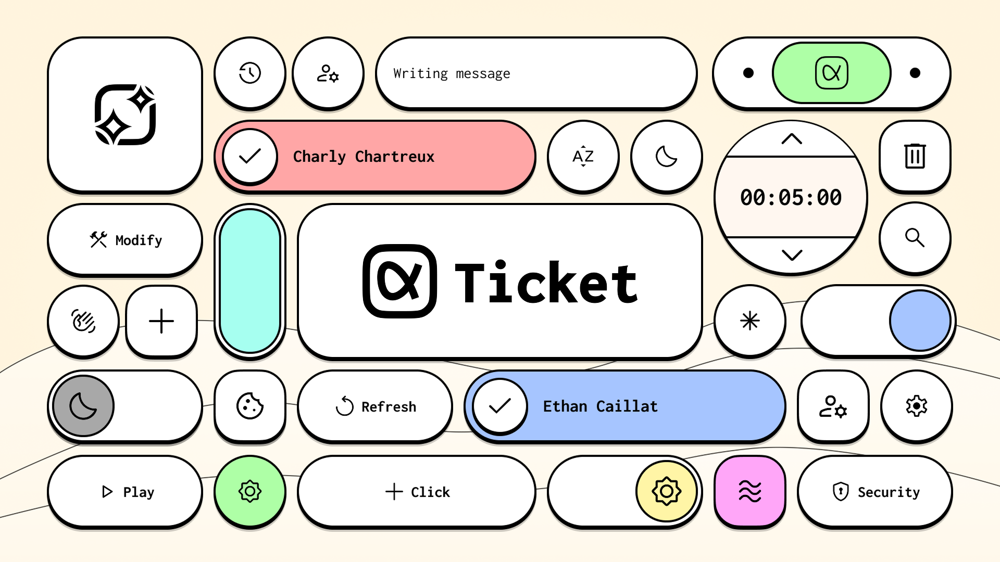
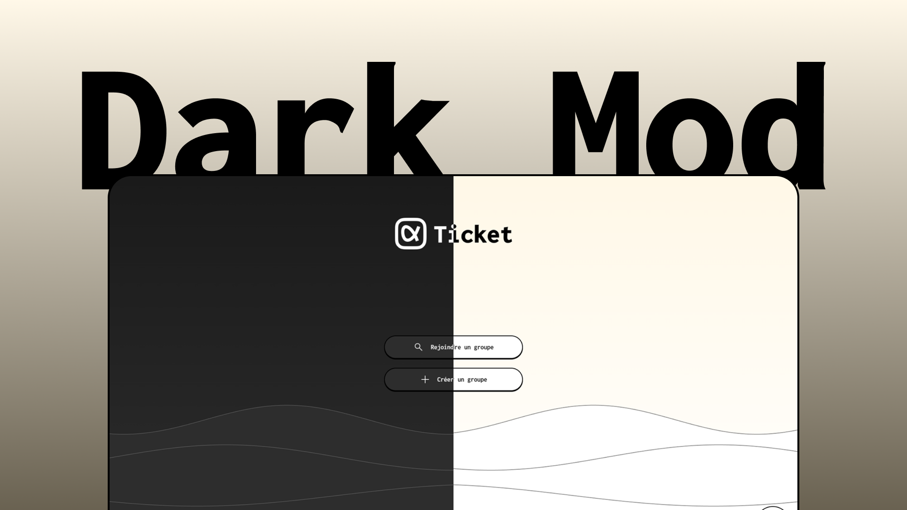
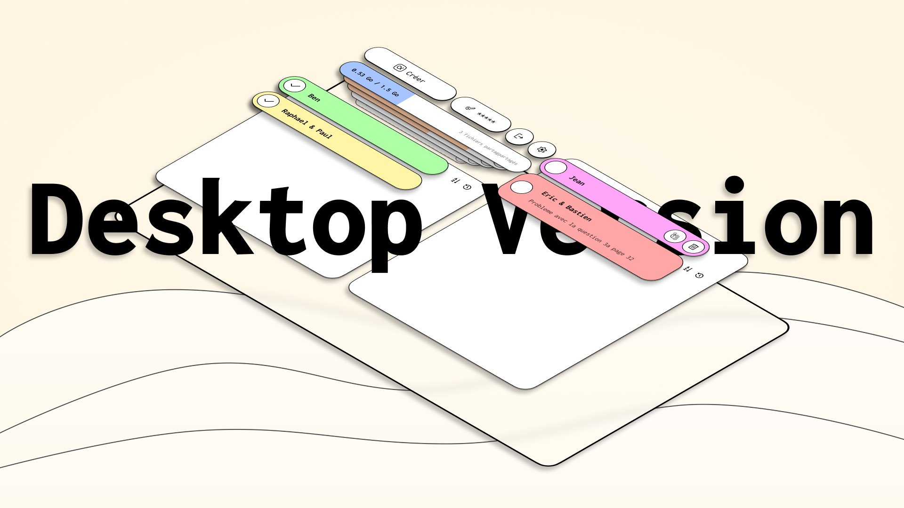
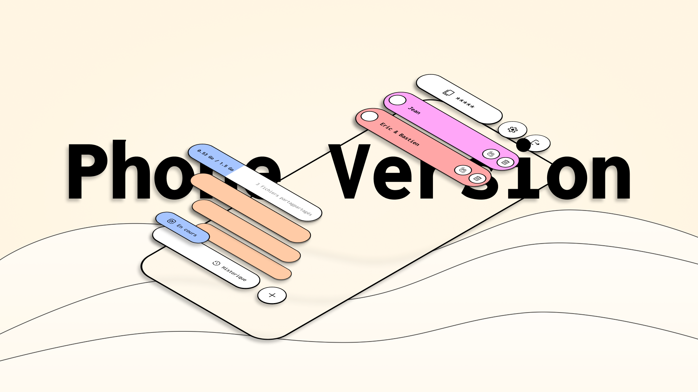
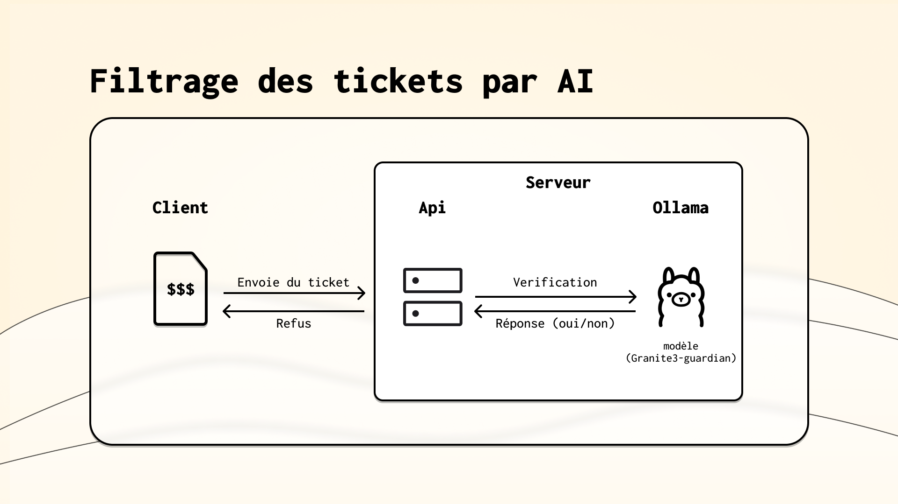

# TICKET
### *Le système de support collaboratif moderne, sécurisé et sans friction*

 

---

## 🌟 L'essence du projet

> **Ticket** est un outil de gestion pour le support technique en éliminant toute barrière d'entrée. Oubliez les inscriptions fastidieuses, les mots de passe oubliés et les interfaces surchargées.

Avec Ticket, créez instantanément un **espace de support privé** et partagez-le avec votre équipe en quelques secondes. Chaque groupe dispose d'un **code unique** généré automatiquement, permettant un accès contrôlé sans compromettre la simplicité.

* 🚫 **Pas d'inscription**
* ⚡ **Instantané**
* 👑 **Contrôle total pour le Owner**

---

## ✨ Une expérience utilisateur repensée

### Design au service de l'humain

Notre interface n'est pas qu'une simple vitrine, c'est une expérience soigneusement orchestrée.

| Pilier | Description |
| :--- | :--- |
| **🎨 Direction Artistique** | Une identité visuelle forte qui rend chaque interaction mémorable. |
| **💫 Animations** | Des mouvements intelligents qui guident l'utilisateur. |
| **👁️ Iconographie** | Des pictogrammes *Material Design* universels. |
| **🌗 Mode Sombre** | Intégral et automatique pour le confort visuel. |

  
  
<i>Mode sombre natif pour un confort optimal</i>

Ticket s'adapte à differents formats et supports pour vous suivre partout

<table>
  <tr>
    <td align="center" width="50%">
      <strong>Support ordinateur</strong>
    </td>
    <td align="center" width="50%">
      <strong>Support smartphone</strong>
    </td>
  </tr>
  <tr>
    <td align="center">
      
    </td>
    <td align="center">
      
    </td>
  </tr>
</table>

---

## 🔐 Sécurité et vie privée : Nos engagements

### 🛡️ Conformité RGPD & Chiffrement

Votre vie privée n'est pas négociable. Ticket intègre les plus hauts standards de sécurité par défaut.

| Engagement | Détails Techniques |
| :--- | :--- |
| **⏱️ Rétention minimale** | Suppression automatique (Auto-Wipe) après **3 heures** d'inactivité. |
| **🔒 Chiffrement E2EE** | Clé unique par groupe. Chiffrement Client ↔ Serveur ↔ Client. |
| **🇪🇺 Hébergement UE** | Stockage temporaire exclusivement sur serveurs européens. |
| **🚫 Zéro exploitation** | Aucune revente, aucune analyse commerciale, jamais. |

---

## 🚀 Fonctionnalités : Puissance et Simplicité

### 🧠 L'intelligence dans les détails

* **Filtrage IA des tickets**
* **Tickets colorés** : Attribuez des couleurs pour une identification instantanée.

### 🛡️ Modération par IA (Ollama)</b>

* **Filtrage automatique** : Détection via *Granite3-guardian 2b*.
  **Blacklist** : Le Owner définit les termes interdits.
* **Précision** : Taux de détection éprouvé jusqu'à **91.03%**.

### 📁 Partage & Administration</b>

* **1.5 Go de stockage** : Documents, images, logs.
* **Transfert sécurisé** : Chiffrement durant le transit.
* **Contrôle total** : Limitation de tickets, bannissement, liens d'invitation.

 
---

## 🔧 Architecture Technique

### 🏗️ Stack Technologique

Notre infrastructure repose sur la robustesse et la modernité.
 

<table>
<tr>
<td align="center" width="96">

 Debian
</td>
<td align="center" width="96">

 Node.js
</td>
<td align="center" width="96">

 HTML5
</td>
<td align="center" width="96">

 CSS3
</td>
<td align="center" width="96">

 JavaScript
</td>
</tr>
</table>

 

**Backend** • Debian • Node.js • Ollama (Granite3-Guardian) • WebSocket  
**Frontend** • HTML5 • CSS3 • Vanilla JS • Material Icons

 

### 🔄 Flux de données

  
   

